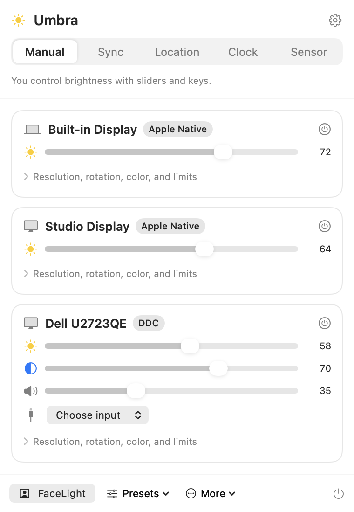
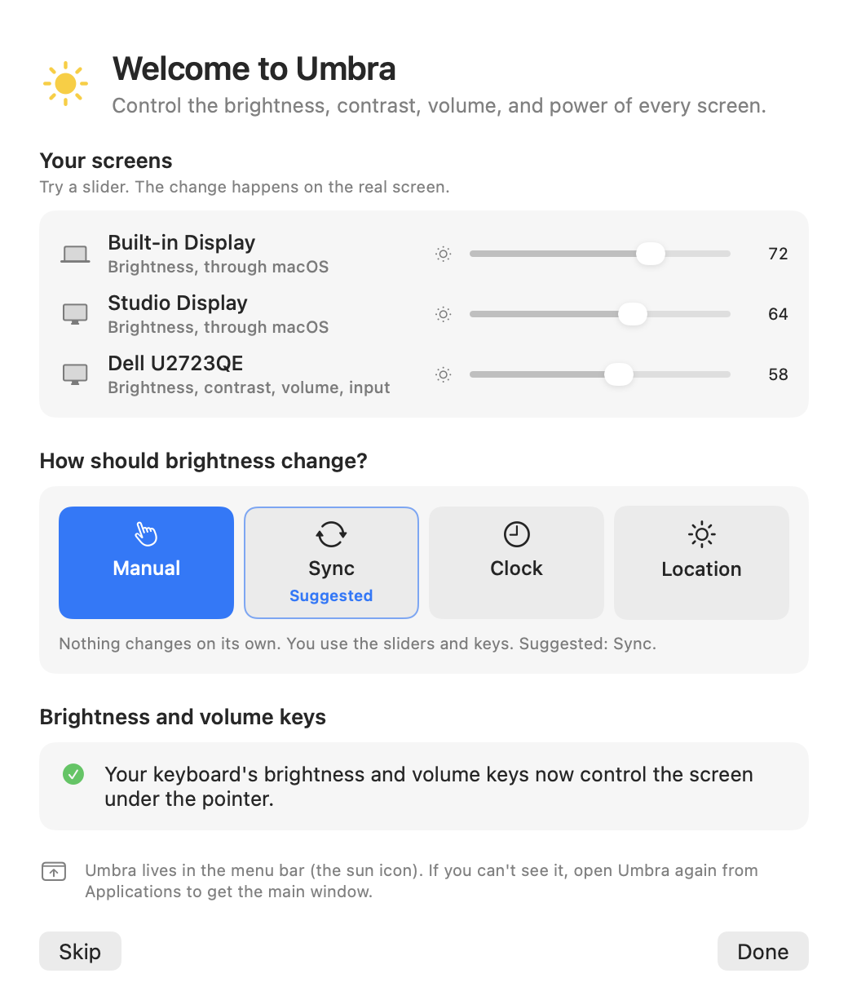
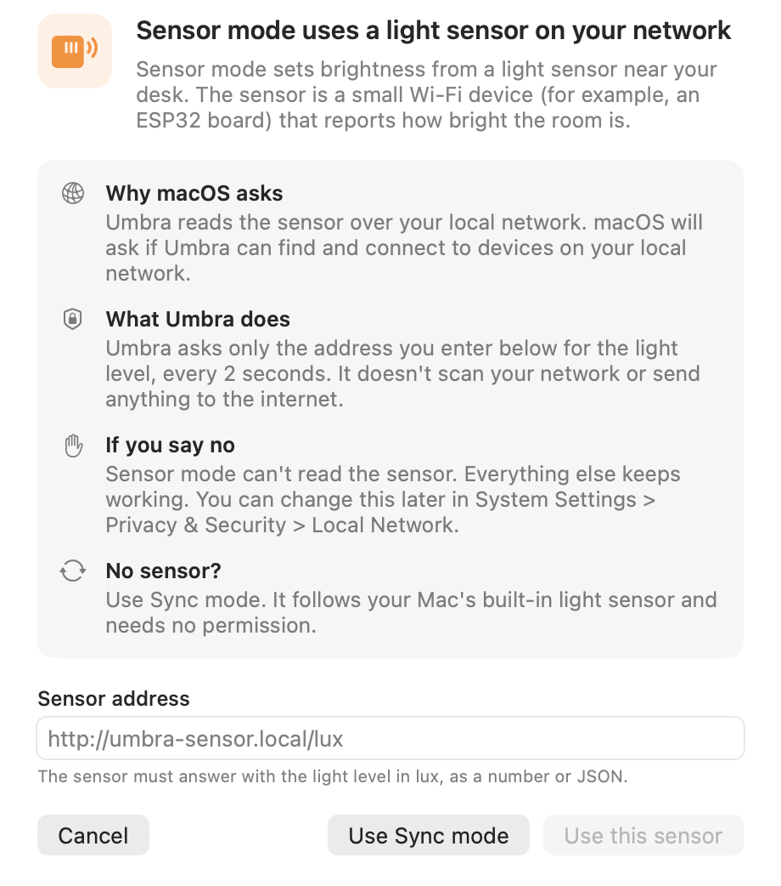

# Umbra

Umbra is a free, open source menu bar app for macOS. It controls the brightness, contrast, volume, input, and power of your monitors, including external monitors over DDC on Apple Silicon.

<p align="center">
  
  &nbsp;&nbsp;
  
</p>

Umbra covers the features of Lunar.app with no paid tier. It is written from scratch and is not affiliated with Lunar or its author.

## Install

Umbra needs macOS 14 or later on an Apple Silicon Mac. Control Center controls need macOS 26.

1. Download the Umbra DMG from the [latest release](https://github.com/JordanCampbellDesign/Umbra/releases/latest), open it, and drag Umbra to Applications.
2. The app isn't notarized by Apple, so the first time you open it, right-click `Umbra.app` and choose **Open**.
3. Umbra explains each permission before macOS asks for it. Accessibility access is only needed for the brightness and volume keys and for Cleaning Mode.

After that, Umbra updates itself. It checks once a day and asks before it installs.

## Features

**Control every screen**
- Brightness, contrast, volume, mute, and input for external monitors over DDC.
- Apple Native control for the built-in display and Apple displays.
- Software dimming for monitors without DDC, and a network relay option (for example a Raspberry Pi running ddcutil).
- Sub-zero dimming below 0%, and XDR Brightness above 100% on XDR displays.
- Resolution, rotation, and color gains per display.

**Brightness that follows you**
- Adaptive modes: Sync (follow the built-in display), Location (follow the sun), Clock (a daily schedule), and Sensor (a light sensor on your network).
- Umbra remembers the mode for each desk setup, so your home and office desks each get their own.
- Optional: contrast follows brightness.
- Fades use springs. Each change of target adds one closed-form spring, so a new target mid-fade never jumps.

**Turn screens off and on**
- BlackOut turns a screen off without unplugging it. Its windows move to your other screens, and USB and charging keep working.
- FaceLight lights your face for video calls. Night Mode dims, lowers contrast, and warms colors, then restores everything.
- Cleaning Mode blacks out every screen and ignores the keyboard so you can wipe them.

**Arrange screens**
- Side by side, top to bottom, others above the main screen, mirror, set main, and swap.
- Every arrangement change switches back after 15 seconds unless you click Keep.

**Many ways to control it**
- Siri: "Turn off my Samsung with Umbra", "Lower the brightness with Umbra", "Turn on Night Mode in Umbra". The same actions appear in the Shortcuts app.
- Control Center and menu bar controls: Night Mode, FaceLight, Brighter, Dimmer, and All Screens On.
- Brightness and volume keys, global hotkeys, and presets per app.
- Scroll over the menu bar icon, or hold ⌃⌥ and scroll anywhere, to change the brightness of the screen under the pointer.
- A CLI and `umbra://` links.
- If the menu bar icon is hidden (for example behind the notch), open Umbra again from Applications to get the main window.

<p align="center">
  
</p>

## Default hotkeys

These match Lunar's defaults where Lunar has the same action.

| Action | Keys |
|---|---|
| Brightness 0%, 25%, 50%, 75%, 100% | ⌃⌘0 to ⌃⌘4 |
| FaceLight | ⌃⌘5 |
| BlackOut the screen under the pointer | ⌃⌘6 |
| BlackOut without mirroring | ⌃⇧⌘6 |
| Power off (DDC standby) | ⌃⌥⌘6 |
| BlackOut all other screens | ⌃⌥⇧⌘6 |
| Turn all screens back on | ⌃⌘7 |
| Next adaptive mode | ⌃⌥⌘L |
| Open the menu | ⌥⇧⌘L |
| Night Mode | ⌃⌥⌘N |

Change any of them in Settings > Hotkeys.

## CLI

Settings > CLI & About installs an `umbra` command. Run `umbra help` for the full list.

```bash
umbra displays
umbra set C27 brightness 40
umbra blackout C27 on
umbra night toggle
umbra arrange horizontal
```

`<display>` is an index from `umbra displays`, part of a name, `all`, or `cursor`. When the app is open, the CLI sends each command to the app and prints its answer.

## Build from source

```bash
brew install xcodegen
git clone https://github.com/JordanCampbellDesign/Umbra.git
cd Umbra
./build.sh
cp -R build/Umbra.app ~/Applications/
```

`build.sh` builds the Xcode project when Xcode is installed. Without Xcode it builds the Swift package, which has no Siri actions, controls, or updates. See [CONTRIBUTING.md](CONTRIBUTING.md) for signing and tests.

## How it works

Umbra uses private macOS frameworks, loaded at runtime:
- `IOAVService` to send DDC commands to external monitors on Apple Silicon.
- `DisplayServices` for Apple Native brightness.
- `SkyLight` to disconnect a screen for BlackOut.
- `MonitorPanel` for rotation.

Because of this, Umbra can't be on the Mac App Store, and a future macOS update could break a feature until Umbra is updated.

Some monitors answer DDC reads with noise. Umbra doesn't need reads: it remembers the last value it sent, like Lunar does. Turn on "Read values from monitor at startup" in Settings > Displays for monitors that answer reads correctly.

## Privacy and security

Umbra has no analytics and sends nothing to the internet, apart from checking GitHub for updates. See [SECURITY.md](SECURITY.md) for how the CLI, links, and controls are limited.

## Credits

Thanks to [Lunar](https://lunar.fyi), [MonitorControl](https://github.com/MonitorControl/MonitorControl), and [m1ddc](https://github.com/waydabber/m1ddc) for showing what's possible with DDC on the Mac, and to [Sparkle](https://sparkle-project.org) for updates.

## License

[MIT](LICENSE)
